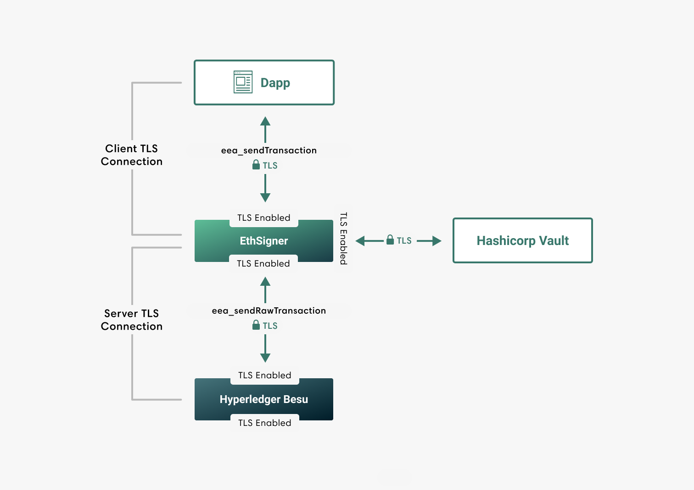

# TLS Communication

EthSigner supports TLS to secure inbound and outbound HTTP JSON-RPC
requests, and [communication with Hashicorp Vault](../HowTo/Store-Keys/Use-Hashicorp.md).

Private keys and certificates for client and server TLS connections must be
stored in password-protected PKCS #12 keystores. The server 
(in this example, Hyperledger Besu) must be configured to accept TLS
connections.

Use the command line options to [enable and configure](../HowTo/Configure-TLS.md) TLS.