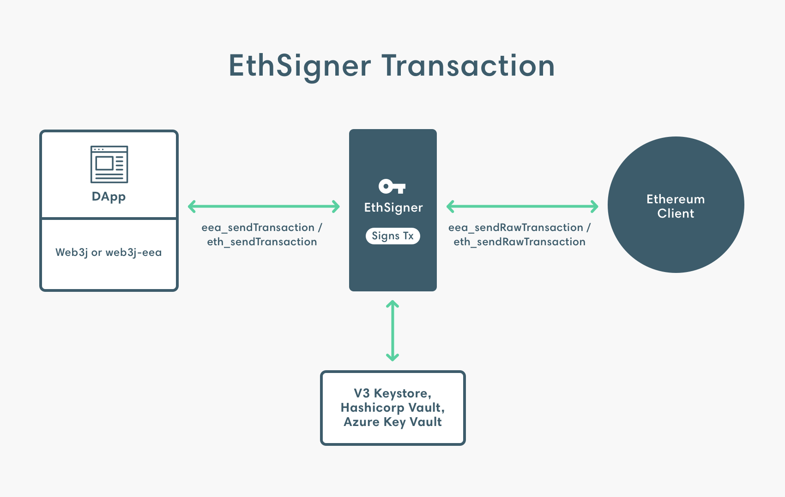

title: EthSigner Transaction Signer
description: EthSigner is an open-source private transaction manager developed under the Apache 2.0 license and written in Java. 
<!--- END of page meta data -->

# EthSigner Transaction Signer

## What is EthSigner?

EthSigner is an open-source, client-agnostic, Ethereum transaction signer developed under the Apache 2.0 license and written in Java. EthSigner separates private key management from transaction validation by signing transactions using a private key that can be secured in a variety of cloud providers, or encrypted on a local disk. 

## How does it work?

EthSigner acts as a proxy service by forwarding requests to the Ethereum client. When EthSigner receives a transaction it generates a signature using the stored private key, and forwards the signed transaction to the Ethereum client.

EthSigner can sign transactions with a key stored in:

* A V3 keystore file stored on a file system accessible by the host.
* [Hashicorp Vault](Using-EthSigner/Hashicorp.md) 
* [Azure Key Vault](Using-EthSigner/Azure.md). 

!!! note
    EthSigner currently only supports using multiple private keys with file-based signing (using V3 keystore files). That is, the location of multiple private keys can be specified when starting EthSigner.
    
    This functionality is not available using Hashicorp Vault or Azure Key Vault.
    
The transaction process when using EthSigner is:

