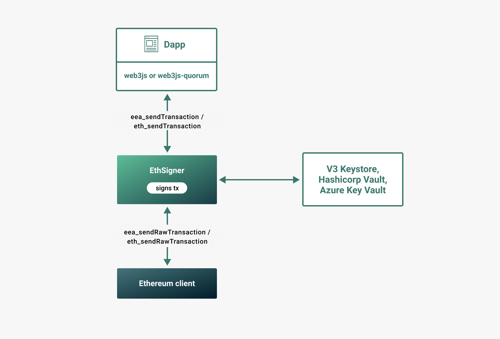

title: EthSigner Transaction Signer
description: EthSigner is an open-source private transaction manager developed under the Apache 2.0 license and written in Java. 
<!--- END of page meta data -->

# EthSigner Transaction Signer

## What is Ethsigner?

EthSigner is an open-source, client-agnostic, Ethereum transaction signer developed under the Apache 2.0 license and written in Java. It adds a layer of security by signing transactions using a private key that can be secured in a variety of cloud providers, or encrypted on a local disk. EthSigner therefore separates private key management from transaction validation. 

## How does it work?

EthSigner acts as a proxy service by forwarding requests between the client and network. When it receives a transaction it will generate a signature using the stored private key, and forward the transaction and signature to the client to include in the blockchain.

!!! note
    EthSigner currently supports a single private key only. That is, only one private key can be stored in the location specified when starting EthSigner.

EthSigner can sign transactions with a key stored in:

* A V3 keystore file
* [Hashicorp Vault](Using-EthSigner/Hashicorp.md) 
* [Azure Key Vault](Using-EthSigner/Azure.md). 

The transaction process when using EthSigner is as follows:

